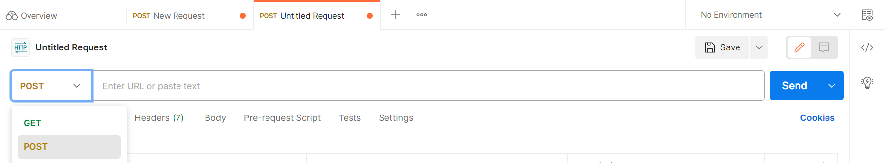
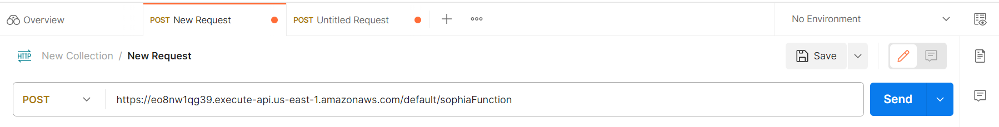
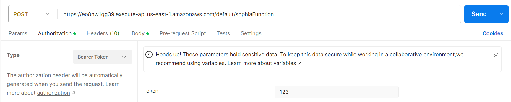
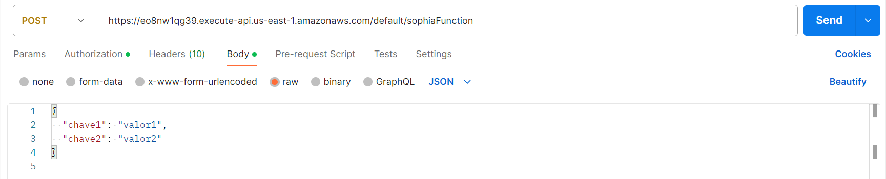
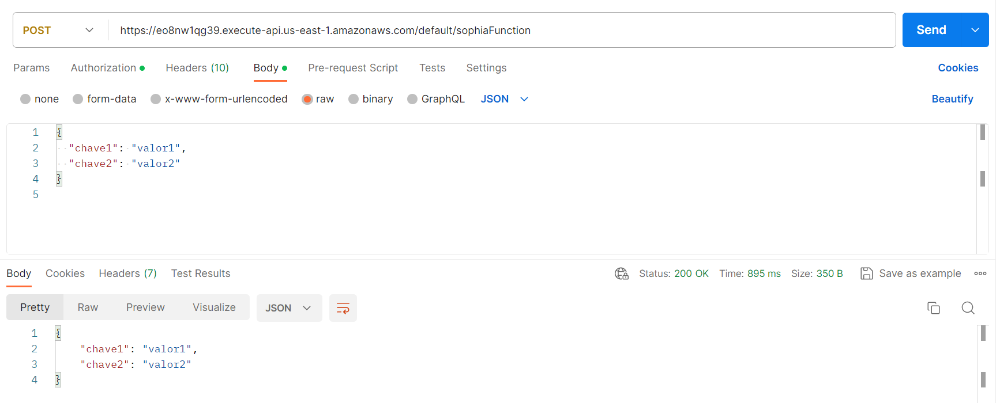

# AWS Lambda com Flask para Autenticação de API

Este repositório contém o código para um serviço AWS Lambda que utiliza o micro-framework Flask para receber mensagens via uma API REST com autenticação. A autenticação é realizada por meio de um token fornecido no cabeçalho da requisição.

## Funcionalidades

- **API REST com Flask**: Utiliza o Flask para criar uma API REST simples e eficiente.
- **Autenticação via Token**: Segurança simples implementada através da autenticação baseada em token.
- **Processamento de JSON**: Capaz de processar e validar o corpo da mensagem em formato JSON.
- **Respostas HTTP**: Envio de respostas HTTP com códigos de status apropriados e headers.

## Teste da rota API Gateway

Para garantir que o método POST estava funcionando conforme esperado, foram feitos os seguintes passos:

1. Selecionar o POST no dropdown de uma 'New Request'

   
2. Adicionar a URL (https://eo8nw1qg39.execute-api.us-east-1.amazonaws.com/default/sophiaFunction) da API

   
3. Em 'Autorization' selecionar 'Bearer Token' e digitar o token do código no input

   
4. Em 'Body', selecionar 'raw' e 'JSON' e digitar um JSON no corpo

   
5. Clicar em 'Send' e visualizar a resposta, como a abaixo

   
